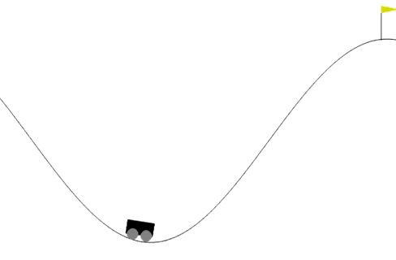

# Solving Mountain Car Deep Q-Network 

## Overview
This project implements a Deep Q-Network (DQN) to make a agent play adequately the game Mountain Car 
 https://www.gymlibrary.dev/environments/classic_control/mountain_car/

## Requirements
- Python 3.x
- Pytorch 
- OpenAI Gym 
- NumPy
- box2d, box2d-kengz
- pygame

## Room for improvement
1. Some paramenter tweaks should be able to improve training efficiency even more

## Video Demonstration
